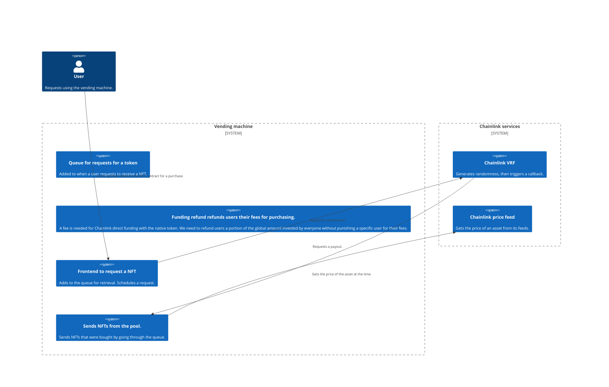
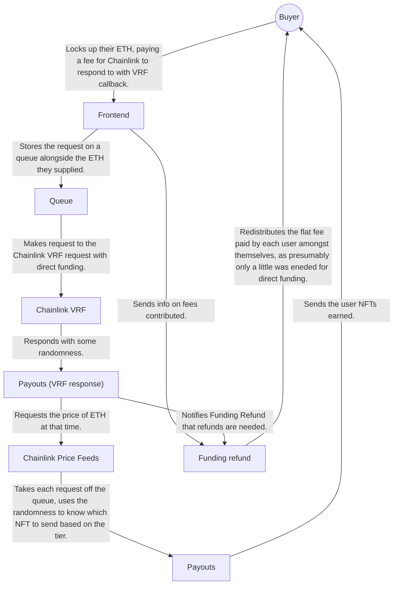

# Vending Machine

This repo is an example of how to use a Chainlink VRF call with a price feed with Arbitrum
Stylus.

## Building

	make build

## Testing

	./tests.sh

## Architecture



## User stories

### Requesting a purchase from the contract



### Refunding users UX

We need to take fees from users who participate in this system, so that we can use
Chainlink's direct funding model with their VRF. To do this, we take a flat fee from
everyone, which is the fee that's needed by Chainlink. After the first user, we start to
record amounts deposited in a shared pool, which is used to refund everyone equally from
the amount paid. This way, we don't punish the first user for being first.

```mermaid
flowchart LR
    PayoutsVRFResp[Payouts (VRF response)]
    -->|"Notifies it's time for fee refunding." FundingRefund[Funding refund]
    -->|Refunds user their flat portion of the VRF fee.| User((Buyer))
```
